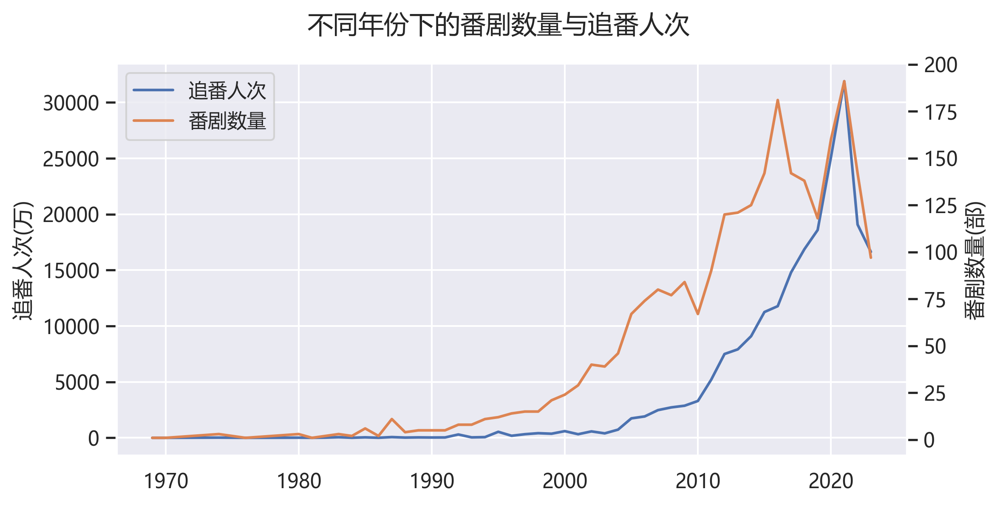

# 标题
## 标题
### 标题


加粗文字  **加粗文字**  
斜体文字  *斜体文字*


<u>下划线</u>  
~~删除文字~~  
>引用，输出内容  
```python
#代码块
print('hello world')
```  
+ 无序列表
+ 无序列表
* 无序列表
* 无序列表
- 无序列表
- 无序列表  

1. 星期一
2. 星期二
3. 星期三

公式$x^2+y^2=z^2$效果
独立公式效果居中
$$x^2+y^2=z^2$$

|表格|时间|状态|
|-|-|-|
|1|2|3|
|4|5|6|

插入网址  
[快速入门](https://zhuanlan.zhihu.com/p/216222290)


${f(x)=a_nx^n+a_{n-1}x^{n-1}+a_{n-2}x^{n-2}}+\cdots$

$$
\begin{pmatrix}
a & b & c \\
d & e & f \\
g & h & i 
\end{pmatrix} 
$$

* 中英文混排时，英文前后各加一个空格：
>请坚信 Markdown 会为你带来生产力的提升
* 中文与数字混排时，数字前后各加一个空格：
>2000 年已经过去了 11 年了
* 代码与中文使用间隔：
>打开命令行终端，输入 'Hellow world'，

中文比较特殊，与其他时进行间隔

***



